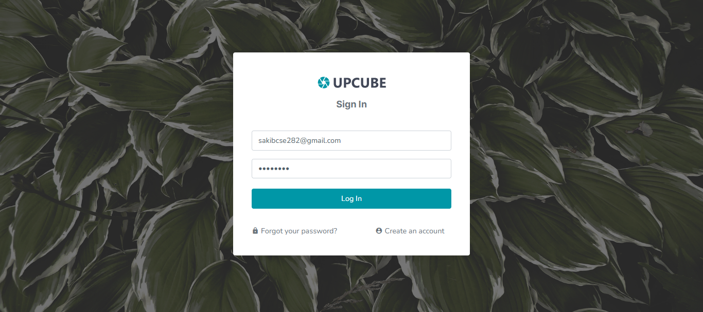
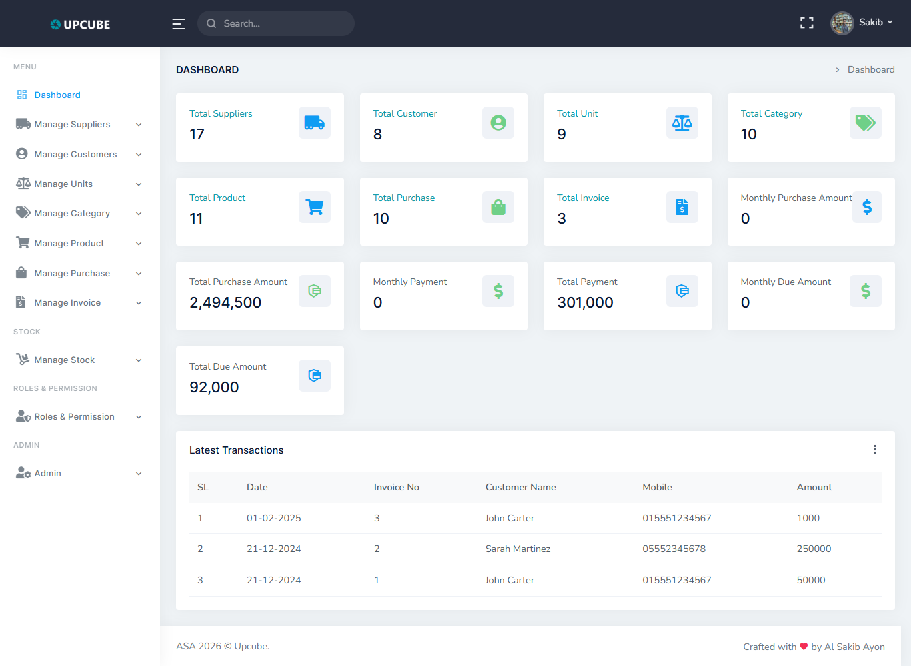
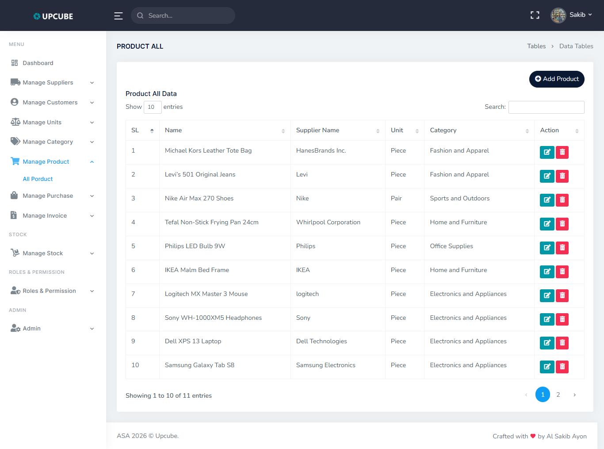
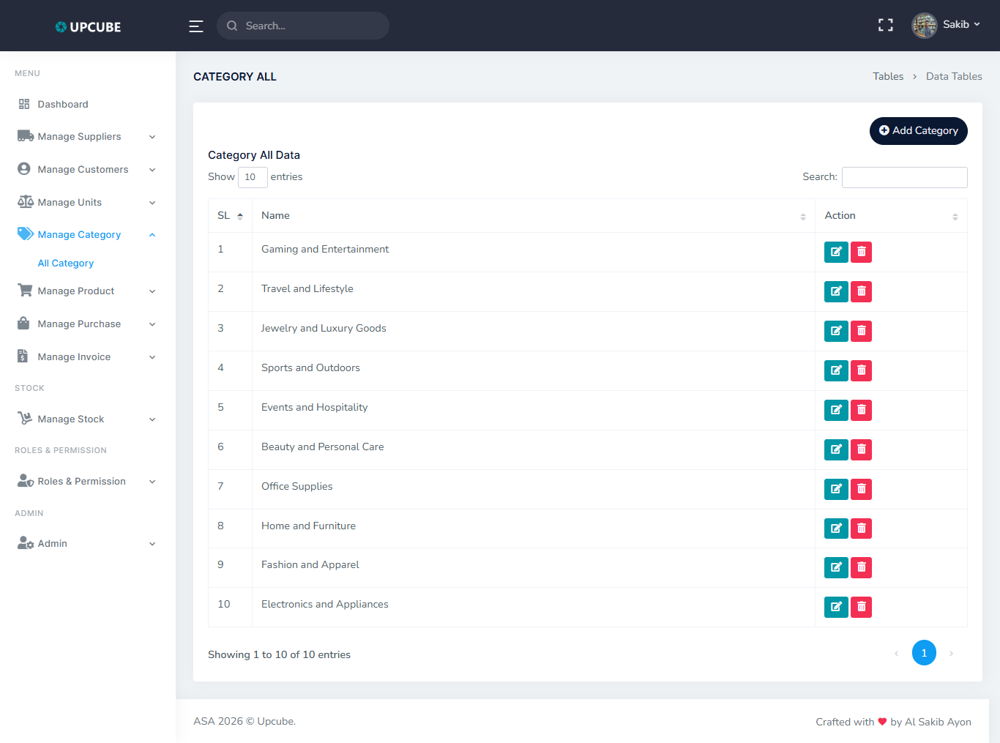
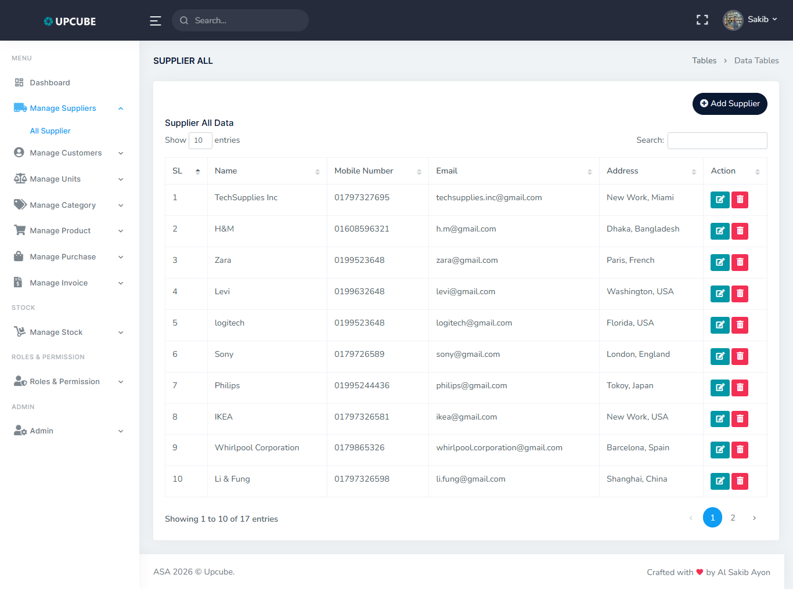
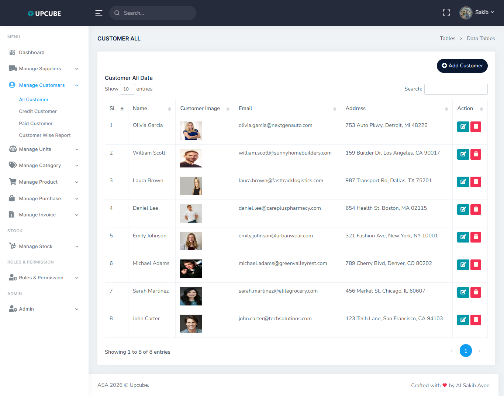
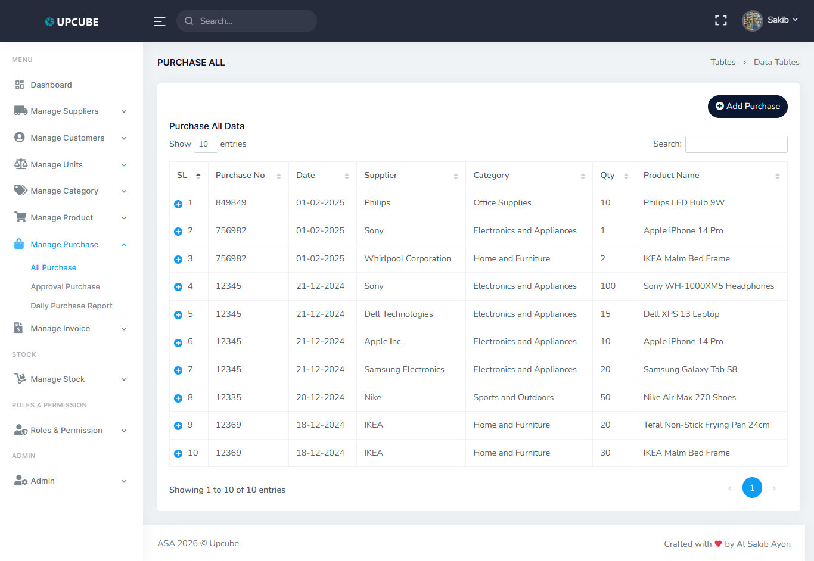
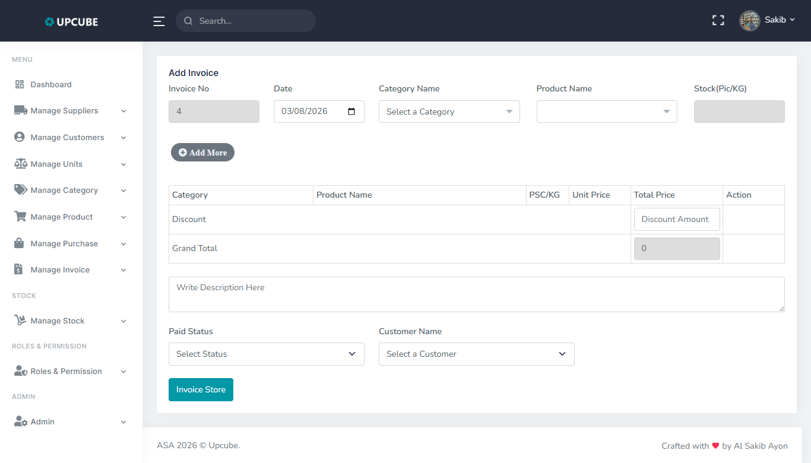
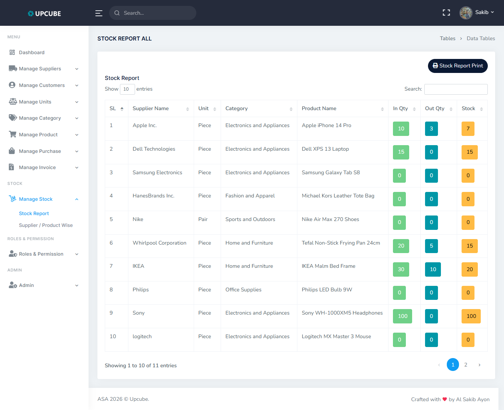
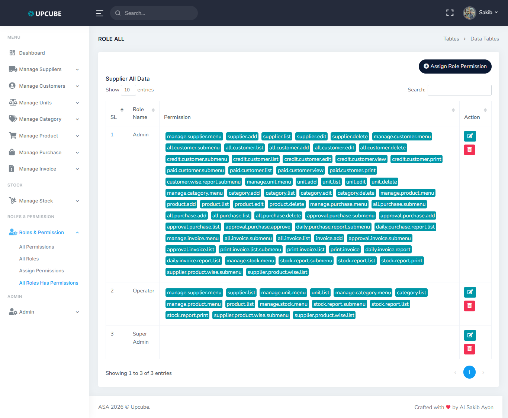

# Inventory Management System (Laravel)

A modern inventory and sales management application built with Laravel for small and medium businesses.

[](https://laravel.com)
[](https://www.php.net)
[](https://opensource.org/licenses/MIT)

## Overview

This project helps manage day-to-day inventory operations in one place, including products, purchases, sales invoices, stock reports, and role-based access control.

## Key Features

- Dashboard with at-a-glance business metrics
- Product, category, and unit management
- Supplier and customer management
- Purchase and invoice workflows
- Stock reporting and inventory tracking
- User authentication and authorization
- Role and permission management using Spatie Permission

## Tech Stack

- Backend: Laravel 11, PHP 8.2+
- Frontend: Blade, Vite, Tailwind CSS, Alpine.js
- Database: MySQL or SQLite
- Image handling: Intervention Image
- Authorization: `spatie/laravel-permission`

## Requirements

- PHP 8.2 or higher
- Composer
- Node.js and npm
- MySQL (or SQLite for local/testing)

## Installation

```bash
git clone https://github.com/alsakib748/Inventory-Management-System-Laravel.git
cd Inventory-Management-System-Laravel
composer install
cp .env.example .env
php artisan key:generate
```

Update your `.env` database settings, then run:

```bash
php artisan migrate --seed
npm install
npm run build
```

For local development:

```bash
php artisan serve
npm run dev
```

## Usage

- Open the app in your browser (default: `http://127.0.0.1:8000`).
- Sign in with your configured credentials.
- Start by setting up categories, units, products, suppliers, and customers.
- Record purchases and create invoices to keep stock and sales data updated.

## Project Screenshots

### Login


### Dashboard


### Product Management


### Category Management


### Supplier Management


### Customer Management


### Purchase Management


### Invoice Management


### Stock Report


### Roles and Permissions


## Testing

```bash
php artisan test
```

## Contributing

Contributions are welcome. Please open an issue first to discuss major changes.

## License

This project is open-sourced under the [MIT license](https://opensource.org/licenses/MIT).
